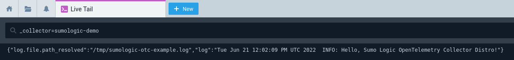

# Installation

The Sumo Logic Distribution for OpenTelemetry Collector can be run using either the binary file available in [Github releases][github_releases] or
the container images stored in AWS Public ECR under the following repository:
[public.ecr.aws/sumologic/sumologic-otel-collector](https://gallery.ecr.aws/sumologic/sumologic-otel-collector).

- [Standalone](#standalone)
  - [Installation using script](#installation-using-script)
    - [Script options](#script-options)
  - [Manual installation](#manual-installation)
    - [Linux on amd64 (x86-64)](#linux-on-amd64-x86-64)
    - [Linux on arm64](#linux-on-arm64)
    - [MacOS on amd64 (x86-64)](#macos-on-amd64-x86-64)
    - [MacOS on arm64 (Apple M1)](#macos-on-arm64-apple-m1-x86-64)
    - [Upgrading standalone installation](#upgrading-standalone-installation)
  - [Verify the installation](#verify-the-installation)
- [Container image](#container-image)
- [Systemd service](#systemd-service)
- [Ansible](#ansible)
- [Puppet](#puppet)
- [Chef](#chef)

## Standalone

Sumo Logic Distribution for OpenTelemetry Collector is a static Go binary.
To run it as a standalone process you only need to run the binary file downloaded from
[Github releases][github_releases] with an appropriate configuration.

### Installation using script

1. Get your [installation token][sumologic_docs_install_token] if you don't have it already and assign it to environment variable:

   ```bash
   export SUMOLOGIC_INSTALL_TOKEN=<TOKEN>
   ```

1. Run installation script:

    Either by piping `curl` straight into `bash`:

    ```bash
    curl -s https://raw.githubusercontent.com/SumoLogic/sumologic-otel-collector/main/scripts/install.sh | sudo -E bash -s -- --installation-token "${SUMOLOGIC_INSTALL_TOKEN}"
    ```

    or by first downloading the script, inspecting its contents for security, and then running it:

   ```bash
   curl -o install-otelcol-sumo.sh https://raw.githubusercontent.com/SumoLogic/sumologic-otel-collector/main/scripts/install.sh
   sudo -E bash ./install-otelcol-sumo.sh --installation-token "${SUMOLOGIC_INSTALL_TOKEN}"
   ```

   The `-E` argument to `sudo` is needed to preserve the `SUMOLOGIC_INSTALL_TOKEN` environment variable in `sudo` session.

    It is going to perform the following operations:

      - install or upgrade operation by placing the latest version as `/usr/local/bin/otelcol-sumo`,
      - get [static configuration](../examples/sumologic.yaml) and place it as `/etc/otelcol-sumo/sumologic.yaml`
      - create user configuration directory (`/etc/otelcol-sumo/conf.d`) with `common.yaml` file which will contain installation token
      - for Systemd:

        - the script is going to get [Systemd service configuration](../examples/systemd/otelcol-sumo.service) and place it as `/etc/systemd/system/otelcol-sumo.service`
        - create a `otelcol-sumo` user and group which will be used to run the service
        - enable `otelcol-sumo` service
        - start `otelcol-sumo` service

#### Script options

The following arguments can be passed to the script:

| long name                        | short name | description                                                                                                                                                                  | takes value                |
|----------------------------------|------------|------------------------------------------------------------------------------------------------------------------------------------------------------------------------------|----------------------------|
| `--installation-token`           | `i`        | Installation token. It has precedence over `SUMOLOGIC_INSTALL_TOKEN` env variable.                                                                                           | yes                        |
| `--skip-install-token`           | `k`        | Skips requirement for installation token. This option do not disable default configuration creation.                                                                         | no                         |
| `--tag`                          | `t`        | Sets tag for collector. This argument can be use multiple times. One per tag.                                                                                                | yes, in `key=value` format |
| `--download-only`                | `w`        | Download new binary only and skip configuration part.                                                                                                                        | no                         |
| `--version`                      | `v`        | Version of Sumo Logic Distribution for OpenTelemetry Collector to install. By defult it gets latest version.                                                                 | yes, e.g. `0.57.2-sumo-1`  |
| `--skip-config`                  | `s`        | Do not create default configuration                                                                                                                                          | no                         |
| `--skip-systemd` | `d`        | Preserves from Systemd service installation.                                                                                                                                 | no                         |
| `--yes`                          | `y`        | Disable confirmation asks.                                                                                                                                                   | no                         |
| `--uninstall`                    | `u`        | Removes Sumo Logic Distribution for OpenTelemetry Collector from the system and disable Systemd service eventually. Use with `--purge` to remove all configurations as well. | no                         |
| `--purge`                        | `p`        | It has to be used with `--uninstall`. It removes all Sumo Logic Distribution for OpenTelemetry Collector related configuration and data.                                     | no                         |
| `--help`                         | `h`        | Prints help and usage.                                                                                                                                                       | no                         |

The following env variables can be used along with script:

| name                      | description                                                                  |
|---------------------------|------------------------------------------------------------------------------|
| `SUMOLOGIC_INSTALL_TOKEN` | Installation token. It can be overridden by `--installation-token` argument. |

### Manual installation

Follow the steps for your platform below.

#### Linux on amd64 (x86-64)

1. Download the release binary:

    ```bash
    curl -sLo otelcol-sumo "https://github.com/SumoLogic/sumologic-otel-collector/releases/download/v0.57.2-sumo-1/otelcol-sumo-0.57.2-sumo-1-linux_amd64"
    ```

1. Install the release binary in your `PATH`:

    ```bash
    chmod +x otelcol-sumo
    sudo mv otelcol-sumo /usr/local/bin/otelcol-sumo
    ```

1. [Verify the installation](#verify-the-installation)

1. Prepare the configuration according to [this](configuration.md) document and save it in `config.yaml`.

   > **IMPORTANT NOTE**:
   > It is recommended to limit access to the configuration file as it contains sensitive information.
   > You can change access permissions to the configuration file using:
   >
   > ```bash
   > chmod 640 config.yaml
   > ```

1. Run Sumo Logic Distribution for OpenTelemetry Collector:

   ```bash
   otelcol-sumo --config config.yaml
   ```

#### Linux on arm64

1. Download the release binary:

    ```bash
    curl -sLo otelcol-sumo "https://github.com/SumoLogic/sumologic-otel-collector/releases/download/v0.57.2-sumo-1/otelcol-sumo-0.57.2-sumo-1-linux_arm64"
    ```

1. Install the release binary in your `PATH`:

    ```bash
    chmod +x otelcol-sumo
    sudo mv otelcol-sumo /usr/local/bin/otelcol-sumo
    ```

1. [Verify the installation](#verify-the-installation)

1. Prepare the configuration according to [this](configuration.md) document and save it in `config.yaml`.

   > **IMPORTANT NOTE**:
   > It is recommended to limit access to the configuration file as it contains sensitive information.
   > You can change access permissions to the configuration file using:
   >
   > ```bash
   > chmod 640 config.yaml
   > ```

1. Run Sumo Logic Distribution for OpenTelemetry Collector:

   ```bash
   otelcol-sumo --config config.yaml
   ```

#### MacOS on amd64 (x86-64)

1. Download the release binary:

    ```bash
    curl -sLo otelcol-sumo "https://github.com/SumoLogic/sumologic-otel-collector/releases/download/v0.57.2-sumo-1/otelcol-sumo-0.57.2-sumo-1-darwin_amd64"
    ```

1. Install the release binary in your `PATH`:

    ```bash
    chmod +x otelcol-sumo
    sudo mv otelcol-sumo /usr/local/bin/otelcol-sumo
    ```

1. [Verify the installation](#verify-the-installation)

1. Prepare the configuration according to [this](configuration.md) document and save it in `config.yaml`.

   > **IMPORTANT NOTE**:
   > It is recommended to limit access to the configuration file as it contains sensitive information.
   > You can change access permissions to the configuration file using:
   >
   > ```bash
   > chmod 640 config.yaml
   > ```

1. Run Sumo Logic Distribution for OpenTelemetry Collector:

   ```bash
   otelcol-sumo --config config.yaml
   ```

#### MacOS on arm64 (Apple M1) (x86-64)

1. Download the release binary:

    ```bash
    curl -sLo otelcol-sumo "https://github.com/SumoLogic/sumologic-otel-collector/releases/download/v0.57.2-sumo-1/otelcol-sumo-0.57.2-sumo-1-darwin_arm64"
    ```

1. Install the release binary in your `PATH`:

    ```bash
    chmod +x otelcol-sumo
    sudo mv otelcol-sumo /usr/local/bin/otelcol-sumo
    ```

1. [Verify the installation](#verify-the-installation)

1. Prepare the configuration according to [this](configuration.md) document and save it in `config.yaml`.

   > **IMPORTANT NOTE**:
   > It is recommended to limit access to the configuration file as it contains sensitive information.
   > You can change access permissions to the configuration file using:
   >
   > ```bash
   > chmod 640 config.yaml
   > ```

1. Run Sumo Logic OT Distro:

   ```bash
   otelcol-sumo --config config.yaml
   ```

#### Upgrading standalone installation

To upgrade, simply perform the above installation steps again,
overwriting the `otelcol-sumo` binary with newer version.

Before running the newer version, make sure to check the [release notes][github_releases]
for potential breaking changes that would require manual migration steps.

[github_releases]: https://github.com/SumoLogic/sumologic-otel-collector/releases

### Verify the installation

1. First of all, verify if `otelcol-sumo` is the right version:

   ```bash
   otelcol-sumo --version
   ```

1. In order to validate the installation, [the example configuration](../examples/verify_installation.yaml) can be used.
   It instructs the Sumo Logic Distribution to read logs from `/tmp/sumologic-demo.log` and send them to Sumo Logic.

   > **Note**: For more details on configuring OT, check out the [following document](./configuration.md).

   The example configuration:

   ```yaml
   exporters:
     sumologic:
       sending_queue:
         enabled: true
         storage: file_storage
     logging:

   extensions:
     file_storage:
       directory: .
     sumologic:
       collector_name: sumologic-demo
       install_token: ${SUMOLOGIC_INSTALL_TOKEN}

   receivers:
     filelog:
       include:
       - /tmp/sumologic-otc-example.log
       include_file_name: false
       include_file_path_resolved: true
       start_at: end

   service:
     extensions: [file_storage, sumologic]
     pipelines:
       logs:
         receivers: [filelog]
         exporters: [sumologic, logging]
   ```

   Please save this configuration as `config.yaml`.

1. In order to send data to Sumo you will also need an [installation token][sumologic_docs_install_token].

   If you have an installation token, you can run otelcol with the example configuration:

   ```bash
   export SUMOLOGIC_INSTALL_TOKEN=<TOKEN>
   ./otelcol-sumo --config=config.yaml
   ```

1. Run `_collector=sumologic-demo` query in [Live Tail][live_tail]

1. Generate some logs in another window:

   ```bash
   echo "$(date --utc) ${hostname} INFO: Hello, Sumo Logic OpenTelemetry Collector Distro\!" >> /tmp/sumologic-otc-example.log
   ```

1. You should be able to see the log in [Live Tail][live_tail] after a few seconds:

   

[sumologic_docs_install_token]: https://help.sumologic.com/docs/manage/security/installation-tokens
[live_tail]: https://help.sumologic.com/docs/search/live-tail/about-live-tail#start-a-live-tail-session

## Container image

To run the Sumo Logic Distribution for OpenTelemetry Collector in a container, you only need to run the container
using the image available in the
[public.ecr.aws/sumologic/sumologic-otel-collector](https://gallery.ecr.aws/sumologic/sumologic-otel-collector)
repository.

1. Set the release version variable:

   ```bash
   export RELEASE_VERSION=0.57.2-sumo-1
   ```

1. Prepare the configuration according to [this](configuration.md) document and save it in `config.yaml`.

   > **IMPORTANT NOTE**:
   > It is recommended to limit access to the configuration file as it contains sensitive information.
   > You can change access permissions to the configuration file using:
   >
   > ```bash
   > chmod 640 config.yaml
   > ```

1. Run the Sumo Logic Distribution for OpenTelemetry Collector in container, e.g.

    ```bash
    docker run --rm -ti --name sumologic-otel-collector \
       -v "$(pwd)/config.yaml:/etc/otel/config.yaml" \
       "public.ecr.aws/sumologic/sumologic-otel-collector:${RELEASE_VERSION}"
    ```

### Important note about local state files when using `sumologicextension`

> **IMPORTANT NOTE**:
>
> When running Sumo Logic Distribution for OpenTelemetry Collector in a container with [`sumologicextension`][sumologicextension],
> one needs to take into account the local state files which are being used locally
> in order to store collector credentials upon successful collector registration.
>
> When the collector is being run with `sumologicextension` (which manages collector
> registration), local directory (which is configured via `collector_credentials_directory`
> in `sumologicextension`, and which is by default set to `$HOME/.sumologic-otel-collector`)
> will be used to store the aforementioned state files.
> Without any mounts defined on the container the collector will register itself
> every time it starts up, creating clutter on Sumo Logic Collector Management page.
>
> In order to avoid that, use volume mounts or any other mechanism to mount
> the collector credentials directory to the container to persist the state
> or use `clobber` configuration option from `sumologicextension` to force collector
> re-registering under the same name, every time is starts up.
>
> One can read more about the above described mechanism in
> [`sumologicextension` README.md][sumologicextension_storing_credentials].

[sumologicextension]: ./../pkg/extension/sumologicextension/README.md
[sumologicextension_storing_credentials]: ./../pkg/extension/sumologicextension/README.md#Storing-credentials

## Systemd Service

> **IMPORTANT NOTE**:
>
> Make sure that the user that will run the `otelcol-sumo` process has access to
> any directories within your filesystem that have been used in you configuration.
>
> For instance, using [filestorage extension][filestorage_help] in your configuration
> like so:
>
> ```yaml
> extensions:
>   file_storage/custom_settings:
>     directory: /var/lib/otelcol/mydir
>     timeout: 1s
> ```
>
> will require that the user running the process has access to `/var/lib/otelcol/mydir`.

[filestorage_help]: ./configuration.md#file-storage-extension

To run opentelemetry collector as Systemd Service please apply following steps:

1. Ensure that `otelcol-sumo` [has been installed](#linux-on-amd64-x86-64) into `/usr/local/bin/otelcol-sumo`:

   ```bash
   /usr/local/bin/otelcol-sumo --version
   ```

1. Create configuration file and save it as `/etc/otelcol-sumo/config.yaml`.

   > **IMPORTANT NOTE**:
   > It is recommended to limit access to the configuration file as it contains sensitive information.
   > You can change access permissions to the configuration file using:
   >
   > ```bash
   > chmod 640 config.yaml
   > ```

1. Create `user` and `group` to run opentelemetry by:

   ```bash
   sudo useradd -mrUs /bin/false otelcol-sumo
   ```

   > **IMPORTANT NOTE**:
   > This command will create a home directory for the user. By default, the `sumologic` extension stores the credentials in a subdirectory of the home directory.
   > However, if the user with name `otelcol-sumo` already exists, it won't be overwritten, so you should make sure that a home directory has been created for this user.
   >
   > If you don't want the user to have a home directory, you should use `useradd` without the `m` flag
   > and explicitely change the directory for saving the credentials, for example:
   >
   > ```yaml
   > extensions:
   >   sumologic:
   >     # ...
   >     collector_credentials_directory: /etc/otelcol-sumo/credentials
   > ```
   >
   > For more information, please refer to the documentation of [sumologic extension][sumologicextension].

1. Ensure that `/etc/otelcol-sumo/config.yaml` can be accessed by `otelcol-sumo` user
   which will be used to run the service.

   ```bash
   $ ls -la /etc/otelcol-sumo/config.yaml
   -rw-r--r-- 1 otelcol-sumo daemon 0 Feb 16 16:23 /etc/otelcol-sumo/config.yaml
   ```

1. Verify if opentelemetry collector runs without errors:

   ```bash
   sudo su -s /bin/bash otelcol-sumo -c '/usr/local/bin/otelcol-sumo --config /etc/otelcol-sumo/config.yaml'
   ```

1. Create service file: `/etc/systemd/system/otelcol-sumo.service`:

   ```conf
   [Unit]
   Description=Sumologic Opentelemetry Collector

   [Service]
   ExecStart=/usr/local/bin/otelcol-sumo --config /etc/otelcol-sumo/config.yaml
   User=otelcol-sumo
   Group=otelcol-sumo
   MemoryHigh=200M
   MemoryMax=300M
   TimeoutStopSec=20

   [Install]
   WantedBy=multi-user.target
   ```

   _Note: adjust memory configuration to your setup._

1. Enable autostart of the service:

   ```bash
   sudo systemctl enable otelcol-sumo
   ```

1. Start service and check status:

   ```bash
   sudo systemctl start otelcol-sumo
   sudo systemctl status otelcol-sumo  # checks status
   sudo journalctl -u otelcol-sumo  # checks logs
   ```

## Ansible

Example installation of Sumo Logic Distribution for OpenTelemetry Collector with Ansible is described in
[examples/ansible](../examples/ansible/README.md).

## Puppet

Example installation of Sumo Logic Distribution for OpenTelemetry Collector with Puppet is described in
[examples/puppet](../examples/puppet/README.md).

## Chef

Example installation of Sumo Logic Distribution for OpenTelemetry Collector with Chef is described in
[examples/chef](../examples/chef/README.md).
